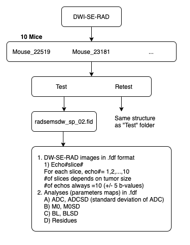

# MouseDiffusionImaging

## Mouse_Abdomen_RAD_DWI_Test_Retest_4.7T
Inside folder “Mouse_Abdomen_RAD_DWI_Test_Retest_4.7T”, there are 10 subfolders, each contains a “test” and a “retest” folder, both having the same structure. Using “test” as example, it has two subfolders: 

*	radsemsdw_sp_02.fid
    * Raw data: fid, procpar (acquisition parameters) and log generated by console 
    * echoXXsliceXX: are 10 b-value images for a slice. Note 10 b-value are ± b-value listed in the paper
    * ADC parametric map of each slice (001, 002…) and ADCSD, which is the pixel-wise standard deviation of ADC.
    * M0 and M0SD are parametric maps of M0 and standard deviation of M0
    * BL and BLSD are parametric maps of BL and standard deviation of BL. 
    * Residue

If you need to convert the fdf files to nifti (or any other ITK supported format), please see https://github.com/PennPancreaticCancerImagingResource/VarianSliceConvert

